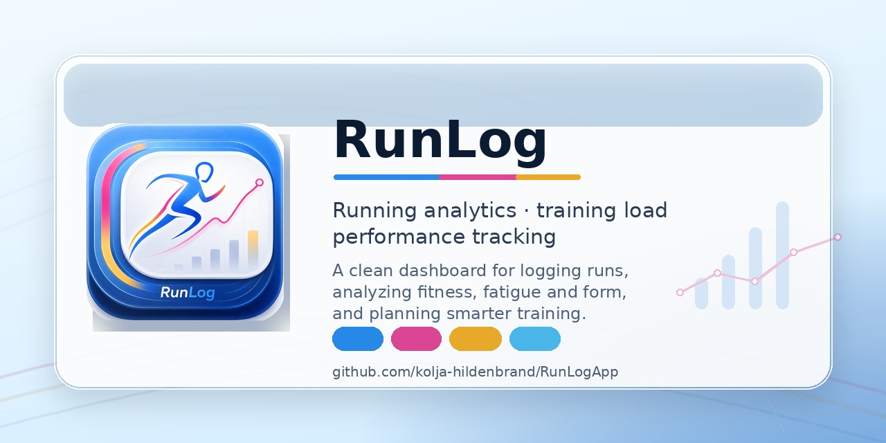

# RunLog — Trainingsplanung, Tracking & TrainingPeaks-Auswertung 

Lokale, in sich geschlossene lokale Web-App für die wöchentliche Trainingsplanung im Langstreckenlauf:
Einheiten planen → sportwissenschaftlich prüfen (passt das zur Phase?) → reale Daten dagegen halten →
druckfertiger Wochenbericht. Läuft komplett offline auf deinem Rechner, keine Cloud oder so im Hintergrund.



## Voraussetzungen
- Node.js ≥ 22 (nutzt das eingebaute `node:sqlite`, kein nativer Build nötig). Getestet mit Node 25.

## Loslegen
```bash
npm install          # einmalig
npm run dev          # Entwicklungs-Modus → http://localhost:5173
```
Für den Alltag (ohne Auto-Reload, ein Prozess):
```bash
npm run build && npm start   # → http://localhost:3000
```

Die Daten liegen in `data/training.db` (SQLite) im Projektordner — einfach zu sichern und liegt mit im iCloud-Ordner.
In der App führt der Footer-Link **„Anleitung"** zu einer Schritt-für-Schritt-Übersicht (`/usage.html`).

## Seiten
- **Dashboard** — Performance Management Chart (PMC) + Aktuelle Woche + Saison-Progression + Intensity-Trend. Stat-Grid mit CTL/ATL/TSB/CTL-Ramp + **VO2max-Kachel** (VDOT, Niveau-Badge, Mini-Sparkline). **v1.10.0:** Signature-Hero „Form-Ribbon" (CTL/ATL/TSB-Band ~6 Wochen mit Draw-on-Animation); **Dark Mode** (Auto/Hell/Dunkel). **v1.11.0:** Sparklines auf CTL/ATL/TSB-Kacheln. Zeitraum umschaltbar.
- **Wochenplanung** — Einheiten je Tag (Sport, Typ, km/min, **km je Zone**, Intervall-Builder, Beschreibung). Phase-Pille klickbar (Inline-Dropdown). Einheiten per Drag-and-Drop verschieben oder ⊕ kopieren. Live-Panel: geplante km vs. Phasenziel, Zonenverteilung & Intensität, geplanter TSS, projizierte Form, regelbasierte Hinweise + **TSS-Empfehlung-Badge** (Ampel aus CTL × Phase). **Engine-Karte** (v1.4.0): Klick „Wochen-Vorschlag" → konkrete Einheiten mit Wochentag · Dauer · Ziel-Pace · Intervallstruktur (planbuilder.ts). **Block-Vorschau** (ausklappbar): Mesozyklus bis Renntag mit **automatischer Periodisierung** (Phasen Base→Belastung→Race-Specific→Taper + 3:1-Entlastung werden vom Renntag abgeleitet, sofern nicht manuell gesetzt). **Einheiten-Bibliothek** (v1.6.1): konkrete Einheiten aus einem sportwissenschaftlich fundierten Katalog (LT1/LT2/VO2max/Berg/Speed/Norwegian) — über den Block **rotierend + progressiv**, **fitness-skaliert** (20×400 nur bei hoher Fitness), mit **Pace-Bereich** (Anker LT1/LT2/CS) + HF-Spanne + Pausen. Selektive Wochenübernahme. Wettkampf-Einheit → Race automatisch angelegt. **Coach-Variation** (v1.8.0): Fartlek, Schwellen-Ladder/Cut-down/Mixed, lange Bergintervalle — distanz- **und** niveaugerecht gewählt (Coach-Matrix). **Zielzeit-Steuerung** (v1.7.0): mit einer Wunsch-Zielzeit am Ziel-Rennen wachsen die Paces Woche-für-Woche dorthin, plus Soll/Ist-Gap-Karte. **Dynamische Einheiten** (v1.11.0): Einheiten zeigen von–bis-Wiederholungen + empfohlenen Tageswert (Phase · TSB · Fitness · VDOT) mit Pace-Band und „angepasst"-Notiz.
- **Tracking** — Wochentag-Switcher (Punkte skalieren mit TSS), Tag/Woche-Umschalter; pro Tag Wellness (Schlaf inkl. Bett-/Aufwachzeit in h:mm & Sleep-Performance, HRV, Ruhepuls, Recovery, Strain, Beine, RPE, Schmerz, Gewicht, …) und Aktivitäten als Kacheln (Typ-Farbbalken, **% Plan-Erfüllung**, Intervall-Belastungen, km je Zone, kcal, Dauer als h:mm:ss, Commute-Schnellerfassung, „+ Zusätzliche Einheit"). Aktivitäten können bewusst **„nicht zuordnen"** sein: reale Last zählt weiter, Plan-Erfüllung nicht. Optionales Zyklus/Symptom-Tracking erscheint nur nach Consent. Strava-Aktivitäten: „↻ Aus Strava neu laden"-Knopf (setzt Intervall-Sperre zurück). Ein Lauf mit Typ „Wettkampf" landet automatisch in Races.
- **Wochenbericht** — geplant-vs-real Tagestabelle mit Notizen + **Plan-Erfüllung als Farb-Kachel je Tag** (≥ 90 % grün / ≥ 70 % gelb / sonst rot), Kategorie-Summen, Zonen-/Intensitäts-Charts, **Efficiency Factor je Wochentag**, PMC bis zur Berichtswoche (+ CTL/ATL/TSB/Ramp), reale Bewertungs-Schilder inkl. **Polarisierungs-Flag** (v1.3.0), Wellness-Schnitt inkl. **Schlaffenster (Bett → Auf)**, Wochen-Check, Reflexion → **Drucken/PDF** (2-seitiges Layout, Wasserzeichen).
- **Langzeit** — PMC + Saison-km, **Intensity-Trend (ATL/CTL)**, Wellness-Verläufe (HRV, Ruhepuls, Recovery, Strain, Schlaf, **Schlaffenster-Chart im Whoop-Stil**, Sleep-Performance, Gewicht, 8-Wochen-Referenzband), Zonen-Effizienz der Easy-Läufe, **Aerobe Entkopplung/Durability-Trend** (v1.4.0), **Zonen-Histogramm HF/Pace** (v1.4.0), **Fitness-Signale CTL+VDOT** (v1.4.0), **Effective VO2max je Lauf + Labor-Eichung** (v1.5.0), **Plan-Erfüllung (Wochenmittel)**, Intervall-Trend (LT1/LT2/VO2) → ebenfalls druckbar. Pace-vs-HF, EF, Entkopplung und effective VO2max zeigen zusätzlich Trendlinie, Monatsmittel und Streuband.
- **Races** (eigene Seite) — Wettkämpfe mit Endzeit, Distanz, Platzierung, Ø-/Max-HF, Höhenmeter, manuellen Splits und Notizen; erscheinen als goldene Marker in den Charts. **Pacing-Plan** (v1.4.0): Zielzeit → km-Splits mit Soll-Pace, GAP (höhenkorrigiert via Minetti), kumulierter Zeit und Mini-Chart. Wettkämpfe aus Saisonplan, Tracking **und Wochenplanung** werden automatisch übernommen.
- **Bestzeiten** (eigene Seite) — persönliche Bestzeiten je Standarddistanz aus Strava + **Critical-Speed-Modell** (CS-Pace, D′, R², Prognosen) mit Distanz-Zeit-Diagramm + **Race-Prediction-Chart** (5k/10k/HM/Marathon über den Saisonverlauf aus dem CS-Modell, Y-Achse invertiert: schneller = oben). **Lauf-Power** (v1.7.0): Critical Power, Power-Duration-Kurve, %CP-Zonen, CP-Trend & RSS aus den Coros-Laufwatt (Stryd-Stil, relativ zu deinen Coros-Watt). **Running Effectiveness** (Ökonomie-Trend) + **W′-bal** (anaerobe Reserve im Intervall, Skiba) (v1.8.0). Kacheln verschieb-/ausblendbar.
- **Methodik** (eigene Seite, v1.6.0) — **N-of-1 Methoden-Findung:** Tabs **Status**, **Was wirkt?**, **Experimente**, **Zyklus**. Aktuelle Marker-Batterie (Critical Speed primär, VDOT, Threshold-Pace/HF, aerobe Entkopplung, Submax-EF, Effective VO2max, Laktat-an-Pace, Polarisierungs-Index), passive Inferenz (Hypothese/Korrelation, mit Confounder-Kontrolle), gerankte prospektiv-randomisierte Trial-Vorschläge und geführte Methoden-Experimente mit Vorher/Nachher-Auswertung. **v1.11.0:** Mini-Sparklines für alle Marker-Verläufe (global abschaltbar); Block-basierte Auswertung (korrekte zusammenhängende Regime-Blöcke). Beobachtung bleibt Hypothese; nur randomisierte Trials können später als „geprüft" gelten.
- **Saisonplan** (eigene Seite) — Wochen anlegen/bearbeiten; automatisch nach Datum sortiert und ab 0 nummeriert.
- **Profil** — Athletenprofil (Geburtsjahr, Geschlecht, Gewicht, Max-HF für VO2max-Norm), HF-Zonen Lauf + **Fahrrad** separat, Pace- und Power-Zonen. **Laktat-/Feldtest-Diagnostik** (v1.3.0): Stufentest eingeben → automatische LT1/LT2-Berechnung (HF + Pace) → Zonen-Set-Vorschlag + Schwellen-Trend über Zeit. **v1.11.0:** x-Achse min/km ↔ km/h ↔ Watt, wissenschaftliche Schwellen-Erklärungen. **Trainings-Verfügbarkeit** (v1.4.0): Zeitbudget je Wochentag, Longrun-Tag, Qualitätstage, Doubles. **VO2max-Laborwerte + Ruhe-HF** (v1.5.0). **Block-Präferenzen** (v1.8.0): Schwerpunkt + Lieblings-/Vermeiden-Einheiten (beratend); Tutorial-Profil. **Eigene Einheiten (v1.12.0):** Verschachtelter Coros-artiger Builder — Segmente/Gruppen in beliebiger Tiefe, Spielraum auf Anzahl, Pace-Offset, eigene Pausen; Engine löst Tageswert nach Form auf. Profile umbenennen/löschen/zurücksetzen.
- **Einstellungen** — Zonen-Sets mit Gültig-ab-Datum, Analyse-Schwellen, **adaptiver Coach (Readiness-Gate advisory/gate)** (v1.5.0), Strava-Verbindung mit **Anreicherungs-Fortschritt** (Doughnuts Details/Streams) und resumierbarer **Strava-Erstanreicherung** mit Backup, Fortschritt, Schrittbetrieb und Pause.
- **Auswahllisten** — Phasen, Sportarten, Einheitstypen, Wochen-Checks und Tagesfaktoren ohne Code-Änderung hinzufügen/umbenennen/umfärben/sortieren (Drag &amp; Drop). **Master-Detail-Layout:** links Kategorie-Navigation, rechts aktive Liste mit Filter.

## Profile (mehrere Personen, ein PC)
Oben in der Sidebar sitzt der Profil-Wechsler („+ Neues Profil…" z. B. für Isabel). Jedes Profil hat
eigene Saison, Einheiten, Tracking-Daten und Zonen-Sets — ohne Passwort, alles lokal. Bestandsdaten
gehören dem Profil „Kolja".

## Strava-Anbindung (optional)
1. Einmalig auf [strava.com/settings/api](https://www.strava.com/settings/api) eine kostenlose API-App anlegen
   („Autorisierungs-Callback-Domain": `localhost`).
2. Client-ID + Client-Secret in **Einstellungen → Strava-Verbindung** eintragen → „Mit Strava verbinden".
3. „Sync ab Datum" (das **„Daten ab"-Datum** ist einstellbar) oder „Ganzes Jahr importieren" (→ PMC fürs ganze Jahr).
   Der Import holt km/Zeit/Ø-HF/Watt + Streams (NGP/NP, Zeit-in-Zone, Bestzeiten) und überschreibt **nie** vorhandene
   oder manuell bearbeitete Einheiten — geräteneutral (kein COROS-Bezug mehr). Wegen des Strava-Rate-Limits
   (100/15 min **und** ~1000/Tag) reichert der Sync Details budgetiert an und stoppt vor dem Tageslimit; die
   Meldung sagt, welches Limit erreicht ist. Optional lassen sich HF-/Power-Zonen + FTP aus Strava importieren
   (Profil → HF-Zonen → „Aus Strava holen"; einmaliges Neu-Verbinden nötig).

## Auswertungs-Modell (an TrainingPeaks angelehnt)
- **TSS** je Einheit, geräteneutral: Lauf = **rTSS** (NGP/Ø-Pace gegen Schwellen-Pace), Rad = **Power-TSS** (NP/FTP) bzw. Schätzung; geplant per Zonen-Allokation (rTSS je Zone). Ein selbst eingetragener TSS hat Vorrang.
- **CTL (Fitness)** = 42-Tage-EWMA, **ATL (Fatigue)** = 7-Tage-EWMA, **TSB (Form)** = CTL − ATL.
- **ACWR (Intensity-Trend)** = ATL/CTL × 100 %: zeigt wo du aktuell im Belastungs-Korridor liegst (5 Bänder von Decreasing bis Excessive; optimal: 80–149 %).
- **VO2max-Schätzung** per VDOT-Formel (Daniels-Gilbert) aus deinen besten Laufzeiten — mit Niveau-Badge nach ACSM-Normen (Alter + Geschlecht). Füllt sich automatisch mit den Strava-Bestzeiten.
- **Race-Prediction** aus dem Critical-Speed-Modell: CS-Pace + D′ aus aeroben Bestzeiten → Prognosekurven 5k/10k/HM/Marathon über den Saisonverlauf.
- **TSS-Wochenempfehlung** (3:1-Prinzip): Korridor aus CTL × Phase — Aufbau, Erhalt, Entlastung, Race Week und Krank haben eigene Faktoren; wird als Ampel-Badge in der Wochenplanung angezeigt.
- **Echte Intensitätsverteilung** (v1.3.0): physiologisches 3-Zonen-Modell (Z1 < LT1 / Z2 = LT1–LT2 / Z3 > LT2) aus gemessener Zeit-in-Zone. **Polarisierungs-Index** (Treff et al. 2019): `PI = log10((Z1/Z2)×Z3)`, PI ≥ 2.0 = polarisiert. Phasenziel-Band (pyramidal / polarisiert / regenerativ).
- **Laktat-/Feldtest-Diagnostik** (v1.3.0): LT1 = Baseline + 0.4 mmol/L (interpoliert); LT2 = modifizierter Dmax/AIS (Polynom-Fit, max. Perpendicular Distance). Kalibriert die Intensitätsverteilung mit echten Schwellenwerten.
- **Wochen-Engine** (v1.3.0): `weekStructureRecommendation()` — regelbasierter Coach aus CTL/TSB/Phase/Readiness. Liefert Periodisierungsmodell (Block vs. traditionell), Schlüsseleinheiten mit TSS-Anteilen, Begründung + Konfidenz.
- **Konkreter Mesoplaner** (v1.4.0): `blockPlan()` — Mesozyklus bis Renntag mit 3:1-Deload + Taper. `concretizeSession()` invertiert die rTSS-Mathe exakt → konkrete Einheiten mit Dauer, Pace, Intervallstruktur. Tages-Scheduler nach Verfügbarkeitsprofil.
- **Race-Pacing** (v1.4.0): Zielzeit → km-Splits mit GAP (Minetti-Gradient-Korrektur), optionalem Negativ-Split. Σ(pace×dist) == Zielzeit exakt.
- **Überlastungs-Frühwarnung** (v1.4.0): `injuryRiskFlag()` — gewichteter Score aus ACWR + Monotonie + CTL-Ramp + Readiness (ok/info/warn/danger).
- **Tagescoach / Coach „Heute"** (v1.2.0): Readiness-Score (0–100) aus Schlaf/HRV/Fatigue/Monotonie/Taper → Trainingsempfehlung (Art, Dauer, Intensität) mit erklärbarer Begründung.
- **Adaptiver Coach** (v1.5.0): `adjustTodaySession()` passt die heutige geplante Einheit an Form/Readiness/Risiko an (TSS skalieren / harte Einheit entschärfen), re-konkretisiert exakt; Gate-Modus advisory/gate. „Anpassung übernehmen" schreibt additiv.
- **Effective VO2max je Lauf** (v1.5.0): `effectiveVo2max()` aus submaximaler HF↔Pace (Daniels-Laufkosten + %VO2R≈%HRR) für stetige Läufe; über Labor-Werte geeicht. Ergänzt das VDOT-Signal um einen täglichen Trend.
- Geplante Einheiten werden in der PMC-Kurve nach vorne projiziert → du siehst vorab, wie die geplante Woche Fitness/Fatigue/Form bewegt.
- Prüf-Engine: Volumen vs. Phasenziel, Ramp-Rate, CTL-Ramp, Form/Taper, Polarisierung (80/20), Quality-Spacing, Longrun-Anteil, Recovery-Readiness, Phasen-Stimmigkeit. Alle Schwellen editierbar.

## Architektur
- `server/` — Express + `node:sqlite`. `db.ts` (Schema/Migrationen/Profile), `load.ts` (TSS/PMC/NGP/Best-Efforts/Zonen-Splits), `analysis.ts` (Prüf-Engine + Plan-Erfüllung + Engine + blockPlan + injuryRiskFlag), `zones.ts` (Zonen-Sets + LT1-Anker), `lactate.ts` (LT1/LT2-Algorithmus, pure), `planbuilder.ts` (v1.4.0: concretizeSession + scheduleWeek, pure), `pacing.ts` (v1.4.0: pacingPlan, pure), `strava.ts` (OAuth/Sync/Zonen-Import), `index.ts` (API + statisches Hosting).
- `client/` — Vite + React + TypeScript, Charts mit Recharts. `pages/`, `charts/`, `components/`, `lib/`.
- Migrationen sind strikt **additiv** (`ALTER TABLE ADD COLUMN` + v2-Tabellen mit Kopie) — Bestandsdaten werden nie angetastet.

## App weitergeben / Datenbank zurücksetzen
Deine Trainingsdaten liegen ausschließlich im Ordner **`data/`** (`data/training.db`). Dieser Ordner ist per
`.gitignore` von der Versionskontrolle ausgenommen. **Beim Update der App** kopierst du einfach deinen
`data/`-Ordner in die neue Version. (Eine alte `training.db` aus dem Projekt-Wurzelordner wird beim ersten
Start einmalig automatisch nach `data/` übernommen; das Original bleibt als `training.db.bak`.)

- **Leere Vorlage erzeugen** (zum Mitgeben): `npm run db:template` → schreibt `training.empty.db`
  (nur Schema + Default-Zonen/Auswahllisten, **keine** persönlichen Daten). Dein `data/`-Ordner bleibt unberührt.
- **Eigene Daten zurücksetzen** (neu anfangen): `npm run db:reset` — sichert deine aktuelle `data/training.db`
  automatisch und legt eine frische an.

**Beim Weitergeben:** den Ordner **ohne `data/`** teilen (die App legt beim ersten Start automatisch eine
leere DB an) oder `training.empty.db` als `data/training.db` mitkopieren. `node_modules/` und `dist/` müssen
nicht mit — sie entstehen via `npm install` / `npm run build`.

## Änderungshistorie
Siehe [CHANGELOG.md](CHANGELOG.md) — aktuell **v2.3.0**.

## Desktop-App (Electron)
Fertige Installer liegen in den [GitHub Releases](../../releases) — als App mit Desktop-Icon, ganz ohne Terminal:

- **macOS:** `RunLog-<version>-arm64.dmg` herunterladen, öffnen, RunLog in den Programme-Ordner ziehen.
  Da die App nicht signiert/notarisiert ist, blockt macOS sie beim ersten Start (Gatekeeper) — oft mit der Meldung
  „… ist beschädigt" oder „… kann nicht geöffnet werden, da Apple sie nicht auf Schadsoftware prüfen kann". Einmalig
  das Quarantäne-Flag entfernen, dann startet die App normal:
  ```bash
  xattr -dr com.apple.quarantine /Applications/RunLog.app
  ```
  (Alternativ bei der „nicht verifizierter Entwickler"-Meldung: **Rechtsklick auf die App → Öffnen**, bzw.
  **Systemeinstellungen → Datenschutz & Sicherheit → „Trotzdem öffnen"**. Bei der „beschädigt"-Meldung hilft nur
  der `xattr`-Befehl oben.)
- **Windows:** `RunLog-Setup-<version>.exe` herunterladen und ausführen. Der Installations-Assistent führt durch
  Pfadwahl und legt Startmenü-Eintrag + Deinstaller an. Da der Installer nicht signiert ist, meldet sich beim
  ersten Start ggf. der Windows-SmartScreen („Unbekannter Herausgeber") → **Weitere Informationen → Trotzdem ausführen**.
- **Linux / Ubuntu:** zwei Varianten —
  - **`.deb`** (Ubuntu/Debian, normale Installation): `sudo apt install ./RunLog-<version>-amd64.deb` (oder per Doppelklick im Software-Center) → Eintrag im App-Menü + Deinstaller.
  - **`.AppImage`** (portabel, jede Distro): herunterladen, ausführbar machen (`chmod +x RunLog-<version>-x86_64.AppImage`) und starten. Auf Ubuntu 24.04 ggf. `sudo apt install libfuse2` nötig.

Deine Trainingsdaten liegen pro Betriebssystem im jeweiligen App-Datenordner
(`~/Library/Application Support/RunLog` auf macOS, `%APPDATA%\RunLog` auf Windows, `~/.config/RunLog` auf Linux) —
getrennt von der App, bleiben bei Updates erhalten.

Wer lieber im Web-Modus arbeitet oder selbst baut: `npm run build && npm start` → [http://localhost:3000](http://localhost:3000) — alle Features sind auch im Browser vollständig verfügbar.

### Selbst bauen
- **macOS:** `npm install && npm run electron:build` → `.dmg` in `release/`.
- **Windows:** `npm install && npm run electron:build:win` → NSIS-`.exe` in `release/`.
- **Linux:** `npm install && npm run electron:build:linux` → `.AppImage` + `.deb` in `release/`.
- **Automatisch (CI):** Beim Pushen eines Tags `v*` (z. B. `git tag v1.0.0 && git push origin v1.0.0`) baut GitHub Actions
  den Windows-Installer (`build-windows.yml`) und die Linux-Pakete (`build-linux.yml`) auf je eigenem Runner und
  hängt sie ans zugehörige Release. (macOS wird lokal gebaut — kostenlose Runner können kein signiertes `.dmg` erzeugen.)

## Ideen für später (siehe ToDo.md „In Zukunft")
Readiness · Dashboard-Tagesvorschlag · Pace-/HF-Histogramm · v2.0-Redesign (GSAP/Three.js)

## Lizenz
[MIT](LICENSE) © 2026 Kolja Hildenbrand
